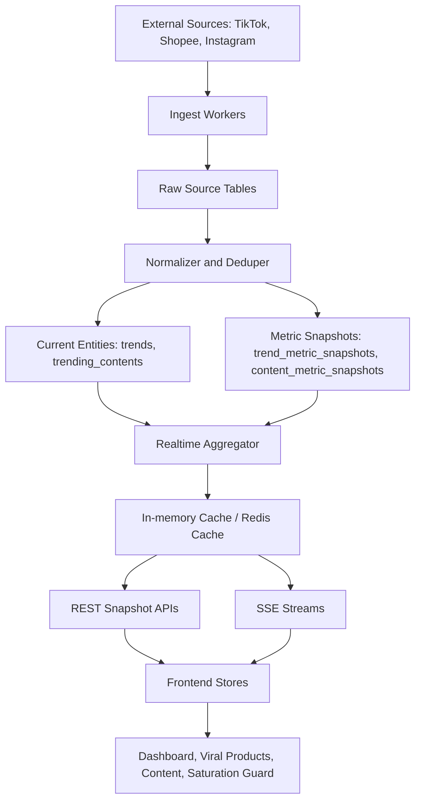

# Backend Roadmap Nexo

Tanggal update: 26 Mei 2026
Repo: `NexoRevNew/app`
Fokus: analisis backend real-time untuk Dashboard, Viral Products, Trending Content, dan Saturation Guard.

Catatan penting: dokumen ini adalah roadmap dan analisis. Ini bukan implementasi kode.

---

## 1. Ringkasan Eksekutif

Tujuan revisi adalah membuat data di aplikasi terasa dinamis dan real-time, terutama pada area yang ditandai:

- Dashboard metric cards:
  - Total Tren Aktif
  - Tren Emerging
  - Avg Saturation
  - Window Terdekat
- Dashboard Growth Momentum:
  - tren aktif dipantau
  - chart grafik
- Data lain seperti Viral Products, Trending Content, AI Insights, Performance Analytics, dan Saturation Guard tetap dinamis, tetapi tidak perlu berubah setiap detik.

Backend saat ini sudah punya fondasi yang cukup untuk prototype:

- Express server.
- Supabase client.
- Auth JWT dan bcrypt.
- Endpoint `/api/trends` untuk Viral Products.
- Chat SSE untuk streaming jawaban AI.
- Notifications route, tetapi masih mock/in-memory.

Namun backend belum punya real-time data layer. Data dashboard masih dihitung di frontend dari list trends. Trending Content masih memakai mock lokal di frontend. Saturation Guard masih bergantung pada selected trend atau fallback mock. Jadi supaya bisa benar-benar real-time, backend perlu dipisah menjadi beberapa layer:

1. Data source layer.
2. Ingest/scraper layer.
3. Metric snapshot layer.
4. Realtime aggregate layer.
5. API dan stream layer.
6. Frontend subscription layer.

Rekomendasi utama:

- Gunakan SSE untuk dashboard realtime per detik karena arah datanya server-to-client dan backend sudah punya pola SSE di chat.
- Analisis backend dashboard sebaiknya berjalan per 1 menit, bukan analisis ulang per detik. UI boleh terasa realtime lewat countdown, stream snapshot, dan animasi halus.
- Gunakan polling ringan atau SSE channel terpisah untuk detail produk/Saturation Guard dengan cadence 10-15 detik.
- Gunakan refresh berkala 30-60 detik untuk Viral Products.
- Gunakan refresh berkala 60-120 detik untuk Trending Content.
- Jangan menulis data ke database setiap detik. Backend boleh emit data setiap detik dari cache/latest snapshot, tetapi database hanya menyimpan current state dan snapshot penting.
- LLM tidak boleh menganalisis semua data setiap menit. Backend harus memakai change detection, input hash, dan threshold perubahan agar LLM hanya dipanggil saat ada sinyal baru yang penting.
- Data lama tidak boleh dicampur dengan data terbaru di tabel utama. Gunakan tabel current untuk kondisi terbaru, tabel snapshot untuk history pendek, dan rollup untuk history panjang.

---

## 2. Status Backend Saat Ini

### 2.1 Server dan Infrastruktur

Yang sudah ada:

- `backend/src/server.js`
- Express server berjalan di port `3001`.
- Middleware:
  - Helmet.
  - CORS.
  - JSON body parser.
  - API rate limit.
  - Chat rate limit.
- Health check:
  - `GET /health`
- Route group:
  - `/api/auth`
  - `/api/trends`
  - `/api/chat`
  - `/api/notifications`

Yang belum ada:

- Realtime hub untuk broadcast data dashboard.
- Logger terstruktur.
- Env validation lengkap.
- Graceful shutdown.
- Standard error response.
- API versioning.
- Background worker untuk scrape/ingest.

### 2.2 Trends / Viral Products

Yang sudah ada:

- `backend/src/controllers/trendController.js`
- `backend/src/routes/trends.js`
- Endpoint:
  - `GET /api/trends`
  - `GET /api/trends/search`
  - `GET /api/trends/:id`
- Data dibaca dari Supabase table `trends`.
- Support pagination, filter, sort, dan search.
- Seed script tersedia di `backend/src/scripts/seedTrends.js`.

Kekurangan:

- Tidak ada history metric.
- Tidak ada endpoint dashboard aggregate.
- Tidak ada ingest endpoint untuk scraper.
- Tidak ada deduping produk lintas platform.
- Tidak ada source metadata seperti `source_url`, `source_platform_id`, `confidence_score`, `last_scraped_at`.
- List trend belum real-time.

### 2.3 Dashboard

Kondisi sekarang:

- `Dashboard.tsx` memanggil `fetchTrends()`.
- Metrik dashboard dihitung frontend via `computeDashboardStats(trends)`.
- `Window Terdekat` sudah punya countdown UI per detik di frontend.
- Growth Momentum chart mengambil `trends.slice(0, 7)`.

Masalah:

- Dashboard aggregate tidak berasal dari backend.
- Tidak ada single source of truth untuk metric cards.
- Jika ada banyak user, masing-masing frontend menghitung sendiri.
- Tidak ada timestamp data, source status, atau freshness indicator.
- Tidak bisa membedakan data yang real-time, stale, mock, atau fallback.

### 2.4 Trending Content

Kondisi sekarang:

- `TrendingContent.tsx` masih import `mockContentData` dari `src/mockData.ts`.
- Backend belum punya:
  - table `trending_contents`
  - controller content
  - route content
  - content metric history
  - scraper/ingest content

Masalah:

- Halaman Trending Content belum backend-driven.
- Tidak bisa real-time sebelum dipindah ke API.
- Tidak ada data freshness.
- Tidak ada platform source tracking.

### 2.5 Saturation Guard

Kondisi sekarang:

- `SaturationGuard.tsx` memakai `selectedTrend` dari global trend store.
- Jika tidak ada selected trend, fallback ke `mockTrends[1]`.
- Gauge dan metric cards dihitung dari data trend yang sudah ada di frontend.

Masalah:

- Tidak ada endpoint khusus untuk saturation detail.
- Tidak ada metric history untuk gauge.
- Tidak ada live update saat halaman guard terbuka.
- Data bisa stale karena selected trend hanya snapshot dari list.

### 2.6 Notifications

Kondisi sekarang:

- Route sudah ada.
- Controller masih mock/in-memory.

Masalah:

- Belum user-specific.
- Belum Supabase-backed.
- Belum ada generator notifikasi dari event trend.
- Belum real-time.

### 2.7 Chat / AI

Kondisi sekarang:

- Chat SSE sudah ada.
- Azure OpenAI optional.
- Fallback response ada.
- History dan daily count masih in-memory.

Masalah:

- Belum auth wajib.
- Belum DB-backed.
- Belum menyimpan context dashboard/trend/content secara konsisten.

---

## 3. Definisi Real-Time yang Sehat

Permintaan "100% real-time" perlu dibagi menjadi beberapa arti supaya backend tidak boros dan tetap benar.

### 3.1 Real-time UI

UI berubah setiap detik.

Contoh:

- Countdown `Window Terdekat`.
- Metric cards dashboard.
- Growth Momentum chart.

Ini bisa dilakukan dengan backend stream per detik atau kombinasi backend snapshot + client-side ticking.

### 3.2 Real-time Backend Snapshot

Backend mengirim state terbaru setiap detik ke frontend.

Contoh:

- `GET /api/dashboard/realtime/stream`
- Event `dashboard.snapshot` dikirim tiap 1 detik.

Data yang dikirim bisa dihitung dari cache/snapshot terbaru, bukan query database berat setiap detik.

### 3.3 Real-time Data Source

Data dari TikTok, Shopee, Instagram, atau scraper benar-benar berubah cepat.

Ini tidak realistis per detik untuk semua source karena:

- Platform eksternal punya rate limit.
- Scraping per detik rawan diblokir.
- Biaya infra naik.
- Database akan penuh snapshot noise.

Rekomendasi:

- Scrape atau ingest eksternal berkala.
- Emit UI realtime dari hasil snapshot terbaru.
- Simpan metric history dalam cadence yang sehat.

### 3.4 Real-time Persistence

Database menyimpan semua perubahan per detik.

Ini tidak disarankan untuk semua data. Simpan hanya snapshot penting:

- Trend/product metrics: 15-60 detik.
- Content metrics: 30-120 detik.
- Dashboard aggregate: 10-60 detik jika butuh audit.
- Countdown window: tidak perlu disimpan tiap detik.

### 3.5 Data Lifecycle agar Database Tidak Membengkak

Masalah utama jika backend menganalisis data tiap 1-5 menit adalah data lama bisa menumpuk dan bercampur dengan data terbaru. Solusi yang tepat bukan menyimpan semua hasil sebagai row permanen, tetapi memisahkan data menjadi beberapa kelas:

1. Current state
   - Tabel utama seperti `trends` dan `trending_contents` hanya menyimpan kondisi terbaru.
   - Worker memakai `upsert`, bukan `insert` terus-menerus.
   - Dashboard, Viral Products, Trending Content, dan Saturation Guard membaca dari current state atau aggregate current.

2. Metric snapshots
   - Tabel seperti `trend_metric_snapshots` dan `content_metric_snapshots` hanya dipakai untuk grafik/history.
   - Snapshot disimpan dengan retention, misalnya 7 hari untuk data per menit.
   - Data lama diringkas menjadi rollup per jam atau per hari.

3. Raw payload
   - Data mentah scraping/API hanya disimpan sementara untuk debug.
   - Retention disarankan 1-3 hari.
   - Jangan jadikan raw payload sebagai sumber query dashboard.

4. LLM analysis
   - Simpan hasil terbaru di field/tabel current seperti `latest_analysis`, `latest_recommendation`, `analysis_input_hash`, dan `last_analyzed_at`.
   - Riwayat full response LLM tidak perlu disimpan selamanya.
   - Jika butuh audit, simpan hanya ringkasan dan batasi 7-14 hari.

Dengan model ini, data tetap up-to-date karena current state selalu ditimpa dengan nilai terbaru, tetapi database tetap efisien karena history dikontrol oleh retention dan rollup.

---

## 4. Cadence Data yang Disarankan

| Area | Update tampilan | Analisis backend/source | Persist database | Catatan |
|---|---:|---:|---:|---|
| Total Tren Aktif | 5-15 detik atau saat snapshot baru | 1 menit | Upsert current + snapshot 1-5 menit | Lebih stabil untuk dibaca user |
| Tren Emerging | 5-15 detik atau saat snapshot baru | 1 menit | Upsert current + snapshot 1-5 menit | Hitung dari phase/signal terbaru |
| Avg Saturation | 5-15 detik atau saat snapshot baru | 1 menit | Upsert current + snapshot 1-5 menit | Jangan query DB berat tiap detik |
| Window Terdekat | 1 detik | 1 menit dari `window_ends_at` | Tidak perlu simpan per detik | Countdown lokal, resync dari backend |
| Growth Momentum total | 10-30 detik | 1 menit | Upsert aggregate current | Jangan berubah terlalu liar |
| Growth Momentum chart | 10-30 detik | 1 menit | Snapshot/rollup terkontrol | Tinggi chart bisa animate halus |
| Tren Real-time cards dashboard | 30-60 detik | 1-5 menit | Upsert current | Supaya kartu tidak flicker |
| Performance Analytics | 30-60 detik | 1-5 menit | Upsert current + rollup | Table lebih stabil |
| Viral Products list | 30-60 detik | 1-5 menit | Upsert current | Sorting/filter tetap stabil |
| Trending Content list | 60-120 detik | 5 menit | Upsert current + snapshot content | Views/engagement bisa dinamis |
| Saturation Guard gauge | 10-15 detik | 1 menit | Upsert current + snapshot 1-5 menit | Window countdown tetap per detik |
| AI Insights | 1-5 menit | Event-based + threshold | Simpan latest analysis saja | LLM dipanggil saat sinyal berubah penting |
| Notifications | Event-based | Saat rule trigger | Insert event penting saja | Tidak perlu interval tetap |

---

## 5. Arsitektur Backend Target

### 5.1 Diagram Alur



### 5.2 Layer yang Dibutuhkan

#### Layer 1: Database Schema

Tambahkan tabel untuk real-time dan history:

- `trend_sources`
- `trend_metric_snapshots`
- `dashboard_metric_snapshots`
- `trending_contents`
- `content_metric_snapshots`
- `ingest_jobs`
- `realtime_events`

Tabel existing yang tetap dipakai:

- `trends`
- `users`
- `sessions`
- `notifications`
- `chat_messages`

#### Layer 2: Ingest Worker

Tugas:

- Ambil data dari source eksternal atau scraper.
- Normalisasi field.
- Dedup produk/konten.
- Simpan current value ke `trends` atau `trending_contents`.
- Simpan history ke snapshot table.

Worker bisa berupa:

- Script Node terpisah.
- Cron job Railway/Render.
- Supabase Edge Function.
- Queue worker jika skala naik.

#### Layer 3: Realtime Aggregator

Tugas:

- Mengambil latest metric dari cache/database.
- Menghitung dashboard metrics.
- Menghitung growth momentum.
- Menghitung AI insight summary.
- Menentukan data freshness.

Output:

- Snapshot JSON siap dikirim ke frontend.

#### Layer 4: Stream Hub

Tugas:

- Menampung client SSE yang subscribe.
- Broadcast dashboard snapshot tiap 1 detik.
- Kirim heartbeat agar koneksi tidak mati diam-diam.
- Cleanup client saat disconnected.
- Support reconnect dengan `Last-Event-ID` jika nanti dibutuhkan.

#### Layer 5: REST API

Endpoint snapshot tetap perlu ada:

- Untuk initial load.
- Untuk fallback saat SSE putus.
- Untuk testing.
- Untuk client yang tidak butuh stream.

---

## 6. API Target

### 6.1 Dashboard Snapshot

Endpoint:

```http
GET /api/dashboard/realtime
```

Respons target:

```json
{
  "data": {
    "updatedAt": "2026-05-26T10:00:00.000Z",
    "cadenceMs": 1000,
    "sourceStatus": "live",
    "metrics": {
      "activeTrends": 12,
      "emergingTrends": 1,
      "avgSaturation": 48,
      "nearestWindowSeconds": 7130,
      "nearestWindowTrendId": "trend-id"
    },
    "deltas": {
      "activeTrends": 2,
      "emergingTrends": 1,
      "avgSaturation": -3.2
    },
    "growthMomentum": {
      "totalWatched": 12,
      "weeklyDeltaPct": 15,
      "items": [
        {
          "trendId": "trend-id",
          "name": "Lampu Tidur 3D Moon",
          "growth": 312,
          "saturation": 15,
          "windowSeconds": 244800
        }
      ]
    }
  }
}
```

### 6.2 Dashboard Stream

Endpoint:

```http
GET /api/dashboard/realtime/stream
```

Event SSE:

```text
event: dashboard.snapshot
data: {"updatedAt":"...","metrics":{...},"growthMomentum":{...}}
```

Heartbeat:

```text
event: ping
data: {"ts":"2026-05-26T10:00:00.000Z"}
```

### 6.3 Viral Products

Existing endpoint tetap:

```http
GET /api/trends?page=1&limit=12&sort=window
GET /api/trends/search?q=lampu
GET /api/trends/:id
```

Tambahan target:

```http
GET /api/trends/:id/realtime
GET /api/trends/:id/metrics?range=24h
POST /api/internal/ingest/trends
```

Catatan:

- `POST /api/internal/ingest/trends` harus protected dengan internal API key, bukan public user token.
- Detail realtime bisa polling 5-15 detik atau SSE jika diperlukan.

### 6.4 Trending Content

Endpoint baru:

```http
GET /api/trending-content
GET /api/trending-content/:id
GET /api/trending-content/search?q=...
GET /api/trending-content/:id/metrics?range=24h
POST /api/internal/ingest/trending-content
```

Filter/sort:

- `platform=TikTok|Instagram|all`
- `productRelevance=true|false`
- `sort=engagement|views|recent`
- `page`
- `limit`

### 6.5 Saturation Guard

Endpoint baru:

```http
GET /api/saturation/summary
GET /api/saturation/trends/:id
GET /api/saturation/trends/:id/stream
```

Respons detail target:

```json
{
  "data": {
    "trendId": "trend-id",
    "name": "Lampu Tidur 3D Moon",
    "saturation": 15,
    "opportunityScore": 85,
    "competitorCount": 8,
    "avgPrice": 125000,
    "reviewVelocity": 156,
    "windowSeconds": 244800,
    "phase": "Emerging",
    "recommendation": "Aman masuk...",
    "updatedAt": "2026-05-26T10:00:00.000Z"
  }
}
```

---

## 7. Database Target

### 7.1 `trends`

Tambahan kolom yang disarankan:

- `source_url`
- `source_platform_id`
- `source_platform`
- `raw_payload`
- `confidence_score`
- `last_scraped_at`
- `last_metric_at`
- `is_active`
- `canonical_key`

Tujuan:

- Menghubungkan data ke source.
- Deduping.
- Menandai freshness.

### 7.2 `trend_metric_snapshots`

Untuk history metric produk.

Field minimal:

- `id`
- `trend_id`
- `growth`
- `saturation`
- `window_seconds`
- `competitor_count`
- `avg_price`
- `review_velocity`
- `phase`
- `source_platform`
- `captured_at`

Index:

- `(trend_id, captured_at desc)`
- `(captured_at desc)`
- `(phase, captured_at desc)`

### 7.3 `dashboard_metric_snapshots`

Opsional, untuk audit aggregate.

Field minimal:

- `id`
- `active_trends`
- `emerging_trends`
- `avg_saturation`
- `nearest_window_seconds`
- `growth_momentum`
- `source_status`
- `captured_at`

Catatan:

- Tidak perlu simpan tiap detik kecuali benar-benar dibutuhkan.
- Rekomendasi simpan tiap 30-60 detik.

### 7.4 `trending_contents`

Field minimal:

- `id`
- `title`
- `creator`
- `platform`
- `views`
- `likes`
- `comments`
- `engagement`
- `thumbnail`
- `duration`
- `url`
- `video_url`
- `product_relevance`
- `related_trend_id`
- `raw_payload`
- `scraped_at`
- `updated_at`

### 7.5 `content_metric_snapshots`

Field minimal:

- `id`
- `content_id`
- `views`
- `likes`
- `comments`
- `engagement`
- `captured_at`

### 7.6 `ingest_jobs`

Untuk tracking proses worker.

Field minimal:

- `id`
- `source`
- `job_type`
- `status`
- `started_at`
- `finished_at`
- `rows_read`
- `rows_inserted`
- `rows_updated`
- `error_message`

### 7.7 Current State, Snapshot, Rollup, dan Retention

Backend harus memakai prinsip "latest first, history controlled". Artinya dashboard dan halaman utama membaca data terbaru dari tabel current, sedangkan history hanya dipakai untuk grafik dan audit terbatas.

#### Tabel current

Tabel current:

- `trends`
- `trending_contents`
- `dashboard_metrics_current` atau cache current di backend
- `trend_latest_analysis` jika analisis LLM dipisah dari tabel `trends`

Aturan:

- Gunakan `upsert` berdasarkan stable key seperti `source_platform`, `source_platform_id`, normalized product name, atau `trend_id`.
- Jangan membuat row baru untuk produk yang sama setiap kali worker berjalan.
- Simpan field seperti `last_scraped_at`, `last_metric_at`, `last_analyzed_at`, `analysis_input_hash`, dan `freshness_status`.
- Query dashboard default harus mengambil dari current state, bukan dari raw history.

#### Tabel snapshot

Tabel snapshot:

- `trend_metric_snapshots`
- `content_metric_snapshots`
- `dashboard_metric_snapshots`

Aturan:

- Simpan snapshot hanya untuk kebutuhan chart, trend comparison, dan audit.
- Cadence awal:
  - Trend metric: 1-5 menit.
  - Content metric: 5 menit.
  - Dashboard metric: 1-5 menit jika perlu audit; jika tidak, cukup cache.
- Jangan simpan snapshot jika value tidak berubah signifikan.
- Tambahkan dedupe sederhana: jangan insert snapshot baru jika hash metric sama dengan snapshot terakhir.

#### Rollup

Untuk history panjang, jangan baca snapshot menit secara langsung. Buat rollup:

- `trend_metric_hourly_rollups`
- `content_metric_hourly_rollups`
- `trend_metric_daily_rollups`

Aturan:

- Snapshot per menit disimpan pendek.
- Rollup per jam disimpan menengah.
- Rollup per hari disimpan panjang.
- Grafik 24 jam boleh pakai snapshot menit atau hourly.
- Grafik 30-90 hari harus pakai hourly/daily rollup.

#### Retention yang disarankan

| Jenis data | Retention awal | Alasan |
|---|---:|---|
| Current state | Selama trend/content aktif | Sumber utama aplikasi |
| Snapshot per menit | 7 hari | Cukup untuk grafik detail jangka pendek |
| Rollup per jam | 30-90 hari | Cukup untuk analisis momentum menengah |
| Rollup per hari | 6-12 bulan | Murah untuk histori panjang |
| Raw payload | 1-3 hari | Debug saja, boros jika disimpan lama |
| Full LLM response lama | 7-14 hari atau tidak disimpan | Hindari data teks menumpuk |
| Latest LLM summary | Selama trend aktif | Dipakai UI dan chat context |

#### Cleanup job

Buat scheduled cleanup harian:

```text
1. Delete raw payload yang lebih tua dari 1-3 hari.
2. Rollup snapshot menit yang lebih tua dari 7 hari menjadi hourly/daily.
3. Delete snapshot menit lama setelah rollup sukses.
4. Delete LLM analysis history lama jika bukan latest.
5. Tandai trend inactive jika window habis dan tidak ada update baru.
```

Cleanup job bisa dijalankan oleh:

- Railway cron.
- Render cron job.
- Supabase scheduled function.
- Script Node yang dipanggil manual saat demo jika belum deploy production.

---

## 8. Pembagian Kerja: AI vs Manual

### 8.1 Bisa Dikerjakan AI

AI bisa mengerjakan:

- Membuat SQL schema/migration.
- Membuat endpoint dashboard snapshot.
- Membuat SSE stream dashboard.
- Membuat service aggregator backend.
- Membuat table dan route Trending Content.
- Mengganti frontend Trending Content dari mock ke API.
- Membuat trend/content metric snapshot controller.
- Membuat ingest endpoint internal.
- Membuat seed data backend untuk trends dan content.
- Membuat API client frontend.
- Membuat reconnect/fallback polling di frontend.
- Membuat validation dengan Zod/Joi.
- Membuat tests API.
- Update `.env.example`.
- Update dokumentasi progress backend.

Cara minta AI:

```text
Implementasikan fase P0 dari backendroadmap.md: schema real-time, dashboard snapshot endpoint, dan SSE dashboard stream. Jangan ubah UI selain wiring data yang diperlukan.
```

Atau:

```text
Kerjakan bagian Trending Content backend dari backendroadmap.md: table, route, controller, seed, dan ubah frontend agar tidak pakai mockContentData.
```

### 8.2 Perlu Dikerjakan Manual oleh User

Manual/user perlu mengerjakan:

- Membuat atau memastikan project Supabase aktif.
- Mengambil `SUPABASE_URL` dan `SUPABASE_SERVICE_KEY`.
- Menentukan source data resmi:
  - scraper sendiri
  - API pihak ketiga
  - manual seed dulu
- Menentukan akun/platform untuk scrape:
  - TikTok
  - Shopee
  - Instagram
- Menentukan batas scraping yang aman secara legal dan teknis.
- Menentukan provider OTP WhatsApp:
  - Fonnte
  - Twilio
  - provider lain
- Mengambil token provider OTP.
- Menentukan platform deploy:
  - Railway
  - Render
  - Fly.io
  - VPS
  - Supabase Edge Functions untuk worker tertentu
- Mengisi environment variables production.
- Mengecek hasil data apakah masuk akal secara bisnis.

Cara manual:

1. Buka Supabase dashboard.
2. Buat project.
3. Copy project URL dan service role key.
4. Isi ke `.env` lokal dan environment deploy.
5. Jalankan SQL schema yang dibuat AI.
6. Jalankan seed atau ingest worker.
7. Cek dashboard data di Supabase Table Editor.
8. Jalankan app lokal dan pastikan UI menerima data.

### 8.3 Dikerjakan Berdua

Butuh AI dan user:

- Finalisasi format data scraper.
- Menentukan rule business untuk status `Aman`, `Waspada`, `Jenuh`.
- Menentukan formula `growth`, `saturation`, `opportunityScore`.
- Menentukan threshold notification.
- Testing production.
- Validasi apakah data real-time terasa natural atau terlalu ramai.

---

## 9. Cara Mengerjakan Roadmap

### Fase P0: Pondasi Real-Time Dashboard

Tujuan:

- Dashboard metric cards dan Growth Momentum punya sumber data backend.
- Frontend bisa receive update per detik.

Dikerjakan AI:

1. Buat route baru `/api/dashboard`.
2. Buat controller dashboard.
3. Buat `GET /api/dashboard/realtime`.
4. Buat `GET /api/dashboard/realtime/stream` dengan SSE.
5. Buat service aggregator.
6. Tambah frontend store untuk dashboard realtime.
7. Ubah `Dashboard.tsx` agar memakai dashboard store.
8. Tambah fallback polling jika SSE putus.
9. Tambah test endpoint dan stream.

Dikerjakan manual:

1. Pastikan `.env` Supabase valid.
2. Pastikan table `trends` sudah ada dan punya data.
3. Jalankan backend lokal.
4. Cek apakah dashboard berubah tiap detik.

Acceptance criteria:

- `GET /api/dashboard/realtime` mengembalikan metrics lengkap.
- SSE mengirim `dashboard.snapshot` tiap 1 detik.
- Total Tren Aktif, Tren Emerging, Avg Saturation, Window Terdekat berubah dari backend stream.
- Growth Momentum total dan chart berubah dari backend stream.
- Jika SSE mati, frontend fallback ke polling.

### Fase P1: Trend Metric History dan Viral Products Dinamis

Tujuan:

- Viral Products bukan hanya current row, tetapi punya history metric.
- Data list produk dinamis, tetapi tidak berubah setiap detik.

Dikerjakan AI:

1. Buat SQL table `trend_metric_snapshots`.
2. Tambah service untuk latest trend metrics.
3. Tambah endpoint `/api/trends/:id/metrics`.
4. Tambah ingest endpoint internal `/api/internal/ingest/trends`.
5. Tambah dedupe helper.
6. Update trend controller agar bisa expose `updatedAt`, `freshness`, dan metric terbaru.
7. Tambah tests.

Dikerjakan manual:

1. Tentukan sumber data trend.
2. Berikan contoh payload scraper/API.
3. Tentukan frekuensi ingest.

Acceptance criteria:

- Viral Products list bisa refresh 15-60 detik.
- Detail produk punya metric history.
- Sorting growth/saturation/window tetap konsisten.
- Data punya timestamp `updatedAt`.

### Fase P1: Trending Content Backend

Tujuan:

- Hapus ketergantungan `mockContentData`.
- Trending Content menjadi backend-driven.

Dikerjakan AI:

1. Buat table `trending_contents`.
2. Buat table `content_metric_snapshots`.
3. Buat route `/api/trending-content`.
4. Buat controller list/detail/search/filter/sort.
5. Buat seed content.
6. Ubah frontend agar fetch dari API.
7. Tambah loading/error/empty state.
8. Tambah tests.

Dikerjakan manual:

1. Tentukan apakah video asli disimpan sebagai `video_url` atau hanya `url` dan `thumbnail`.
2. Tentukan platform source.
3. Cek legal/terms scraping.

Acceptance criteria:

- Trending Content tidak lagi import `mockContentData`.
- List content berasal dari backend.
- Filter TikTok/Instagram bekerja dari API.
- Count "konten terkurasi" berasal dari backend.

### Fase P1: Saturation Guard Real-Time Detail

Tujuan:

- Gauge memakai data backend terbaru.
- Window countdown tetap per detik.
- Metric cards detail refresh berkala.

Dikerjakan AI:

1. Buat route `/api/saturation`.
2. Buat endpoint `/api/saturation/trends/:id`.
3. Opsional buat SSE `/api/saturation/trends/:id/stream`.
4. Ubah `SaturationGuard.tsx` agar tidak fallback ke mock kecuali API gagal.
5. Tambah history chart untuk competitor density dari snapshot.
6. Tambah tests.

Dikerjakan manual:

1. Finalisasi formula opportunity score.
2. Finalisasi threshold:
   - Aman
   - Waspada
   - Jenuh

Acceptance criteria:

- Saturation Guard menampilkan trend terpilih dari backend.
- Gauge update 5-15 detik.
- Window countdown akurat dan resync dari backend.

### Fase P2: Notifications Real-Time

Tujuan:

- Notifikasi muncul dari event trend, bukan mock.

Dikerjakan AI:

1. Pindahkan notifications ke Supabase.
2. Pasang `verifyToken`.
3. Buat notification generator:
   - new emerging trend
   - saturation melewati threshold
   - window hampir habis
   - trend masuk Peak/Decay
4. Tambah SSE notification stream.
5. Tambah pagination dan delete endpoint.

Dikerjakan manual:

1. Tentukan threshold notifikasi.
2. Tentukan apakah notifikasi dikirim in-app saja atau juga WhatsApp/email.

Acceptance criteria:

- User hanya melihat notifikasinya sendiri.
- Notification badge update tanpa refresh manual.
- Mark read persist di database.

### Fase P2: Chat Persistence dan Context

Tujuan:

- Chat AI punya history dan context dari trend/content/dashboard.

Dikerjakan AI:

1. Simpan chat history ke `chat_messages`.
2. Hitung daily limit dari database.
3. Pasang auth wajib.
4. Tambah context payload:
   - trend
   - content
   - insight
   - dashboard snapshot
5. Batasi panjang message.
6. Inisialisasi Azure client sekali saat startup.

Dikerjakan manual:

1. Siapkan Azure OpenAI resource jika ingin mode production.
2. Isi env Azure.
3. Review kualitas jawaban AI.

Acceptance criteria:

- History tidak hilang saat server restart.
- Limit chat tetap jalan walau server restart.
- Jawaban AI bisa memakai data trend/content terbaru.

---

## 10. Roadmap Prioritas

### P0 - Wajib

1. Dashboard realtime snapshot API.
2. Dashboard SSE stream per detik.
3. Frontend dashboard store untuk stream.
4. Fallback polling.
5. Backend progress update.

Alasan:

- Ini langsung menjawab revisi utama: angka dashboard dan Growth Momentum real-time per detik.

### P1 - Data Layer

1. Trend metric snapshots.
2. Viral Products dynamic refresh.
3. Trending Content backend.
4. Saturation Guard backend detail.

Alasan:

- Membuat semua halaman tidak lagi bergantung pada data statis/mock.

### P2 - Production Readiness

1. Auth enforcement di route data.
2. Notifications Supabase-backed.
3. Chat persistence.
4. Validation.
5. Logging.
6. Tests.

Alasan:

- Membuat backend layak production.

### P3 - Scale

1. Queue worker.
2. Redis cache.
3. Multi-instance stream pub/sub.
4. Observability dashboard.
5. Alerting.

Alasan:

- Dibutuhkan jika user banyak atau ingest source makin berat.

---

## 11. Strategy Teknis SSE vs WebSocket

### Rekomendasi v1: SSE

Pakai SSE untuk:

- Dashboard realtime.
- Notification realtime.
- Saturation detail optional.

Alasan:

- Lebih sederhana dari WebSocket.
- Cocok untuk one-way server-to-client.
- Backend sudah punya pola SSE di chat.
- Auto-reconnect didukung browser.
- Tidak perlu protocol custom kompleks.

Kekurangan:

- Tidak cocok untuk komunikasi dua arah intensif.
- Perlu perhatian khusus jika deploy di platform yang punya timeout.

### Kapan Pakai WebSocket

Pakai WebSocket jika nanti:

- User perlu subscribe banyak topic realtime.
- Ada collaborative feature.
- Client perlu kirim event cepat ke server.
- Butuh low-latency bidirectional.

Untuk kebutuhan sekarang, SSE cukup.

---

## 12. Formula dan Data Policy

### 12.1 Active Trends

Rekomendasi:

- Hitung dari trend yang `is_active = true`.
- Atau dari `window_seconds > 0`.
- Bisa ditambah filter freshness: `last_metric_at` tidak lebih tua dari X jam.

### 12.2 Emerging Trends

Rekomendasi:

Trend dianggap emerging jika:

- `phase = Emerging`, atau
- `growth >= threshold` dan `saturation <= threshold`.

Threshold awal:

- `growth >= 150`
- `saturation <= 35`

Threshold final perlu diputuskan user dan bisa diubah setelah testing.

### 12.3 Avg Saturation

Rekomendasi:

- Average dari active trends.
- Gunakan latest snapshot.
- Bulatkan ke integer untuk dashboard.

### 12.4 Window Terdekat

Rekomendasi:

- Simpan `window_ends_at`, bukan hanya `window_hours`.
- Backend hitung:

```text
nearestWindowSeconds = max(0, window_ends_at - now)
```

Alasan:

- Lebih akurat untuk countdown.
- Tidak perlu update DB per detik.

### 12.5 Growth Momentum Chart

Rekomendasi:

- Ambil top 7 active trends berdasarkan `growth`.
- Kirim `growth`, `name`, `trendId`, `saturation`, `windowSeconds`.
- Frontend animasikan tinggi bar.

### 12.6 LLM Analysis Policy

LLM analysis tidak boleh berjalan untuk semua item setiap menit karena akan boros biaya, memperbesar database, dan membuat rekomendasi tidak stabil. Backend harus memakai rule berikut.

#### Kapan LLM perlu dipanggil

Panggil LLM hanya jika salah satu kondisi terjadi:

- Trend/content baru ditemukan.
- `growth` berubah signifikan, misalnya lebih dari 10-15%.
- `saturation` berubah signifikan, misalnya lebih dari 5-10 poin.
- `phase` berubah, misalnya `Emerging` ke `Growing` atau `Peak` ke `Decay`.
- `window_seconds` masuk threshold penting, misalnya kurang dari 6 jam.
- `competitor_count` atau `review_velocity` melonjak tajam.
- Analisis lama sudah expired, misalnya 30-60 menit untuk trend aktif.

#### Kapan LLM tidak perlu dipanggil

Jangan panggil LLM jika:

- Metric berubah kecil dan tidak mengubah keputusan.
- Input hash sama dengan analisis terakhir.
- Data source masih stale.
- Trend sudah inactive/decay dan tidak sedang dibuka user.

#### Hash dan dedupe analisis

Sebelum memanggil LLM, backend membuat hash input:

```text
analysis_input_hash = hash(
  trend_id +
  growth_bucket +
  saturation_bucket +
  phase +
  window_bucket +
  competitor_bucket
)
```

Gunakan bucket agar perubahan kecil tidak memicu analisis ulang. Contoh:

- `growth_bucket`: dibulatkan per 10%.
- `saturation_bucket`: dibulatkan per 5 poin.
- `window_bucket`: dibulatkan per 1 jam.
- `competitor_bucket`: dibulatkan per 10 kompetitor.

Jika `analysis_input_hash` sama dengan hash terakhir, skip LLM dan pakai `latest_analysis`.

#### Penyimpanan hasil LLM

Simpan hasil terbaru di current state:

- `latest_llm_summary`
- `latest_recommendation`
- `latest_risk_reason`
- `latest_action_items`
- `analysis_input_hash`
- `last_analyzed_at`
- `analysis_expires_at`

Jika perlu history, buat tabel `llm_analysis_history`, tetapi batasi retention 7-14 hari dan jangan dipakai untuk query dashboard utama.

---

## 13. Cara Kerja Real-Time tanpa Boros Database

Masalah umum:

- Kalau setiap detik update row database untuk semua produk, DB cepat berat.
- Kalau setiap user polling DB per detik, backend cepat berat.
- Kalau hasil LLM di-insert terus tanpa retention, tabel analysis akan cepat penuh dan rekomendasi lama bercampur dengan data terbaru.

Solusi:

1. Worker update source metrics berkala setiap 1-5 menit.
2. Worker melakukan dedupe dan `upsert` ke tabel current, bukan insert terus-menerus.
3. Backend menyimpan latest metrics di memory cache.
4. Aggregator menghitung dashboard snapshot dari cache/current state.
5. SSE atau polling ringan mengirim snapshot ke frontend.
6. Database hanya menyimpan snapshot penting per 1-5 menit jika value berubah signifikan.
7. Snapshot lama di-rollup dan dihapus lewat cleanup job.
8. LLM hanya dipanggil saat hash input berubah atau ada trigger penting.
9. Hasil LLM terbaru menimpa `latest_analysis`; history LLM dibatasi retention.

Flow efisien:

```text
Source data
  -> normalize + dedupe
  -> upsert current state
  -> optional metric snapshot
  -> aggregate current dashboard
  -> cache
  -> UI stream/polling
```

Flow LLM efisien:

```text
Current metric berubah
  -> hitung analysis_input_hash
  -> hash sama: pakai latest_analysis
  -> hash beda/signifikan: panggil LLM
  -> simpan latest_analysis
  -> optional history dengan TTL
```

Jika skala masih kecil:

- Memory cache di Node process cukup.
- Cleanup bisa berupa script harian.
- Rollup bisa dilakukan manual/cron sederhana.

Jika skala production dan multi-instance:

- Tambah Redis.
- Gunakan pub/sub.
- SSE server subscribe Redis channel.
- Cleanup dan rollup dijalankan sebagai worker terpisah.

---

## 14. Testing yang Dibutuhkan

### Backend Tests

- Dashboard snapshot returns expected shape.
- Dashboard aggregate handles empty trends.
- Dashboard aggregate computes active/emerging/avg/window.
- SSE stream sends event every second.
- SSE stream cleanup on disconnect.
- `/api/trends` existing behavior remains stable.
- Trending Content list/detail/filter works.
- Saturation detail returns score and metrics.
- Protected route returns 401 without token.
- Upsert current state does not create duplicate trend/content rows.
- Snapshot insert skips unchanged metric hash.
- Cleanup job deletes expired raw payload and old LLM history.
- Rollup job creates hourly/daily summaries before deleting old minute snapshots.
- LLM analysis is skipped when `analysis_input_hash` is unchanged.

### Frontend Tests

- Dashboard subscribes to SSE.
- Dashboard updates metric cards from stream.
- Dashboard fallback polling works when stream fails.
- Growth Momentum chart updates without layout shift.
- Viral Products list does not re-sort too aggressively while user is interacting.
- Trending Content no longer depends on mock data.
- Saturation Guard resyncs selected trend detail.

### Manual QA

- Open dashboard for 2 minutes and watch numbers.
- Confirm only allowed areas change per second.
- Confirm list cards do not flicker.
- Confirm refresh still works after backend restart.
- Confirm SSE reconnect works after network disconnect.

---

## 15. Environment Variables Target

Tambahkan ke `.env.example` nanti:

```env
# Backend
PORT=3001
NODE_ENV=development
FRONTEND_URL=http://localhost:3000

# Supabase
SUPABASE_URL=
SUPABASE_SERVICE_KEY=

# JWT
JWT_SECRET=
JWT_EXPIRES_IN=7d

# Realtime
DASHBOARD_REALTIME_INTERVAL_MS=1000
TREND_REFRESH_INTERVAL_MS=30000
CONTENT_REFRESH_INTERVAL_MS=60000
SATURATION_REFRESH_INTERVAL_MS=10000

# Data lifecycle
TREND_SNAPSHOT_RETENTION_DAYS=7
CONTENT_SNAPSHOT_RETENTION_DAYS=7
RAW_PAYLOAD_RETENTION_DAYS=3
LLM_HISTORY_RETENTION_DAYS=14
ROLLUP_HOURLY_RETENTION_DAYS=90
ROLLUP_DAILY_RETENTION_DAYS=365

# LLM analysis policy
LLM_ANALYSIS_TTL_MINUTES=60
LLM_GROWTH_CHANGE_THRESHOLD=15
LLM_SATURATION_CHANGE_THRESHOLD=8

# Internal ingest
INTERNAL_INGEST_API_KEY=

# Azure OpenAI
AZURE_OPENAI_ENDPOINT=
AZURE_OPENAI_KEY=
AZURE_OPENAI_DEPLOYMENT=

# OTP provider
FONNTE_TOKEN=
```

---

## 16. Checklist Eksekusi

### Manual First

- [ ] Buat/cek Supabase project.
- [ ] Isi `SUPABASE_URL`.
- [ ] Isi `SUPABASE_SERVICE_KEY`.
- [ ] Tentukan source data trend.
- [ ] Tentukan source data content.
- [ ] Tentukan apakah scraping legal dan aman.
- [ ] Tentukan provider OTP.
- [ ] Tentukan platform deploy.

### AI Phase 1

- [ ] Buat SQL schema real-time.
- [ ] Buat dashboard aggregate service.
- [ ] Buat dashboard snapshot endpoint.
- [ ] Buat dashboard SSE endpoint.
- [ ] Buat frontend dashboard realtime store.
- [ ] Wire Dashboard ke backend realtime.
- [ ] Tambah fallback polling.
- [ ] Tambah tests.

### AI Phase 2

- [ ] Buat trend metric snapshots.
- [ ] Buat ingest trends endpoint.
- [ ] Buat trending content backend.
- [ ] Ubah Trending Content frontend dari mock ke API.
- [ ] Buat saturation detail endpoint.
- [ ] Wire Saturation Guard ke backend.
- [ ] Terapkan current-state upsert policy agar data terbaru tidak bercampur dengan data lama.
- [ ] Buat cleanup job untuk raw payload, snapshot lama, dan LLM history.
- [ ] Buat rollup hourly/daily untuk history panjang.
- [ ] Tambah `analysis_input_hash` agar LLM tidak menganalisis ulang input yang sama.

### AI Phase 3

- [ ] Refactor notifications ke Supabase.
- [ ] Tambah notification stream.
- [ ] Simpan chat history ke Supabase.
- [ ] Pasang auth konsisten.
- [ ] Tambah validation dan logger.
- [ ] Tambah production tests.

---

## 17. Perintah yang Bisa Dipakai Nanti

### Jalankan Backend

```powershell
cd C:\Users\Kuro\Music\main\NexoRevNew\app\backend
npm run dev
```

### Jalankan Frontend

```powershell
cd C:\Users\Kuro\Music\main\NexoRevNew\app
npm run dev
```

### Seed Trends

```powershell
cd C:\Users\Kuro\Music\main\NexoRevNew\app\backend
npm run seed:trends
```

### Test Health Check

```powershell
Invoke-RestMethod http://localhost:3001/health
```

### Test Trends API

```powershell
Invoke-RestMethod "http://localhost:3001/api/trends?page=1&limit=12"
```

### Test Dashboard Snapshot Nanti

```powershell
Invoke-RestMethod "http://localhost:3001/api/dashboard/realtime"
```

### Test Dashboard SSE Nanti

```powershell
curl.exe -N "http://localhost:3001/api/dashboard/realtime/stream"
```

---

## 18. Risiko dan Mitigasi

### Risiko: UI terlalu sering berubah

Mitigasi:

- Hanya dashboard metric cards dan Growth Momentum yang update per detik.
- List/cards update lebih lambat.
- Gunakan transition halus.

### Risiko: Database berat

Mitigasi:

- Jangan write per detik.
- Gunakan in-memory cache.
- Persist snapshot berkala.
- Tambahkan Redis saat scale.

### Risiko: Scraper diblokir

Mitigasi:

- Pakai API resmi jika ada.
- Tambahkan rate limit.
- Simpan `source_status`.
- Sediakan fallback seed/manual ingest.

### Risiko: Data tidak akurat

Mitigasi:

- Simpan `confidence_score`.
- Simpan raw payload.
- Tampilkan freshness.
- Review threshold dengan data nyata.

### Risiko: SSE putus di production

Mitigasi:

- Heartbeat event.
- Auto reconnect.
- Fallback polling.
- Test di platform deploy.

---

## 19. Definition of Done

Backend real-time dianggap selesai untuk v1 jika:

- Dashboard metric cards memakai backend realtime stream.
- Growth Momentum memakai backend realtime stream.
- Window Terdekat dihitung dari `window_ends_at` atau seconds backend, lalu countdown stabil di frontend.
- Viral Products berasal dari backend dan bisa refresh berkala.
- Trending Content berasal dari backend, bukan mock frontend.
- Saturation Guard mengambil detail dari backend.
- Data punya `updatedAt` dan freshness status.
- Jika stream putus, UI tetap berjalan lewat fallback polling.
- Progress backend terdokumentasi.

Backend production-ready dianggap selesai jika:

- Auth enforcement konsisten.
- Notifications DB-backed.
- Chat history DB-backed.
- Ingest pipeline berjalan.
- Tests tersedia.
- Logging dan env validation aktif.
- Deployment environment sudah dikonfigurasi.

---

## 20. Rekomendasi Urutan Paling Aman

Urutan terbaik:

1. Buat dashboard realtime snapshot + SSE.
2. Wire Dashboard ke stream.
3. Tambah trend metric snapshots.
4. Buat Trending Content backend.
5. Wire Trending Content ke API.
6. Buat Saturation Guard backend detail.
7. Tambah ingest endpoint internal.
8. Tambah notifications event-based.
9. Tambah chat persistence.
10. Hardening security, logging, tests, deploy.

Alasan:

- Step 1-2 langsung menyelesaikan revisi visual utama.
- Step 3-6 menghapus data statis/mock di halaman penting.
- Step 7-10 membuat sistem siap production.
